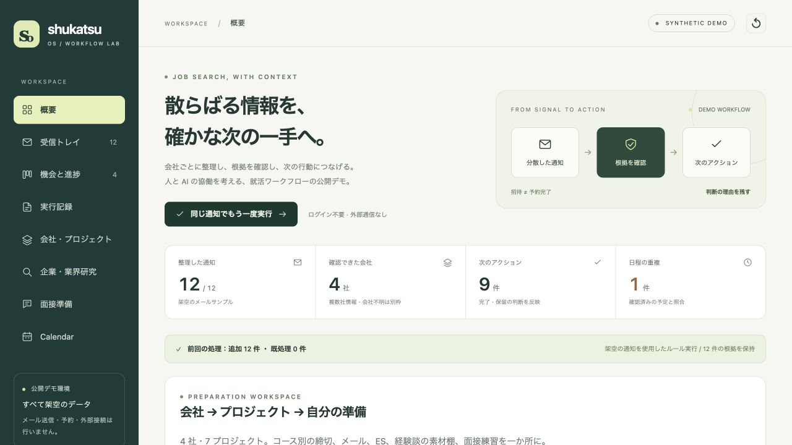
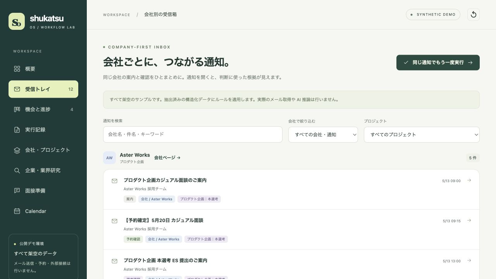
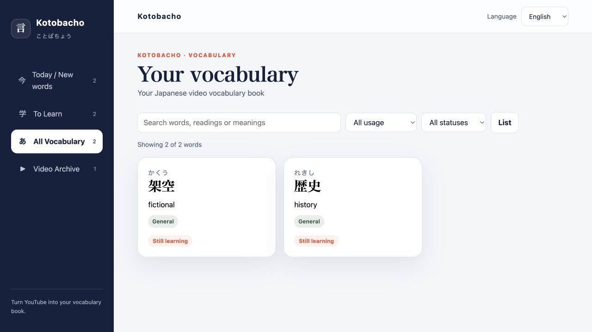
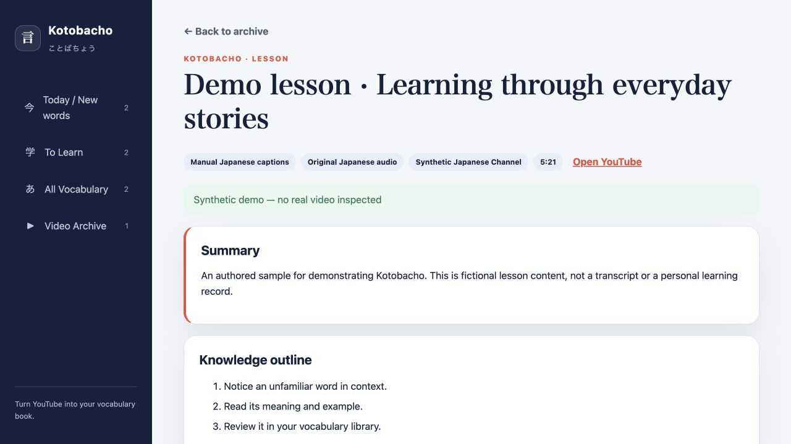

# プロジェクト紹介

## Shukatsu OS

[公開デモを開く](https://yaenyanyako.github.io/shukatsu-os-showcase/) · [リポジトリ](https://github.com/YAEnyanyako/shukatsu-os-showcase)

### 課題

同じ会社から届く通知でも、募集コースや必要な対応は異なります。招待、予約確認、提出期限、キャンセル期限を区別して整理する必要があります。

### 設計上の判断

| 課題 | 設計 |
|---|---|
| 会社の情報が複数の通知に分散する | 会社別ワークスペースを入口にする |
| 同じ会社の異なる募集が混ざる | 会社 → プロジェクト → 出来事に分ける |
| 招待を予約完了と取り違える | 通知の種類、確認根拠、次の行動を分ける |
| 日付の意味が異なる | 提出期限、開催日時、取消期限を区別する |
| 不明な情報から誤った行動につながる | 不明な項目は確認待ちにし、判断の根拠を表示する |

### デモで試せること

架空の4社・7プロジェクト・初期通知12件を収録。会社別メール、プロジェクト別締切、ESの下書き、研究資料、面接準備、Calendarのシミュレーションを確認できます。再実行時の重複処理も試せます。

公開デモは構造化済みのサンプルデータを使用します。実メールの取得、AI推論、送信、予約、実カレンダーへの接続は行いません。Calendar操作はシミュレーションです。

## Kotobacho

[リポジトリと導入方法](https://github.com/YAEnyanyako/kotobacho)

### 課題

日本語動画で出会った単語を復習するには、読み方、意味、文脈、元の場面を一緒に残せることが役立ちます。

### 設計上の判断

- 内蔵レベル判定テストを必須にせず、動画から学習を始める。
- 確認した日本語字幕をもとに教材を作り、単語と動画の時刻を紐づける。
- Today、To Learn、All Vocabulary、Video Archiveの4画面で整理する。
- 検索、用法・学習状態の絞り込み、単語の状態変更に対応する。
- 学習記録をローカルに保存し、公開サンプルと分離する。

実際のUIに、独自に作成した架空の教材を読み込んだ画面です。実動画の文字起こしや個人の学習記録ではありません。画面内の件数はデモ用であり、利用者数や学習効果を示すものではありません。

## 実装と検証

AIによる開発支援を使用しています。実装と確認済みの検証結果は公開リポジトリを参照してください。この紹介では、外部ユーザー数、作業時間の削減、学習効果の実測値を主張していません。
